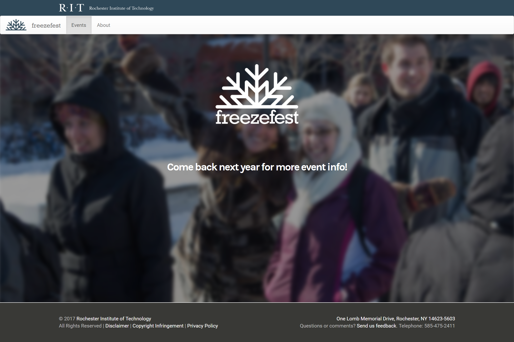

# Freezefest2017
My work as a developer for RIT's Center for Campus Life (CCL). Built a site for RIT's annual Freezefest event using Drupal, PHP, CSS, and Javascript.

[View at RIT's Freezefest website](http://www.rit.edu/studentaffairs/campuslife/freezefest/)
